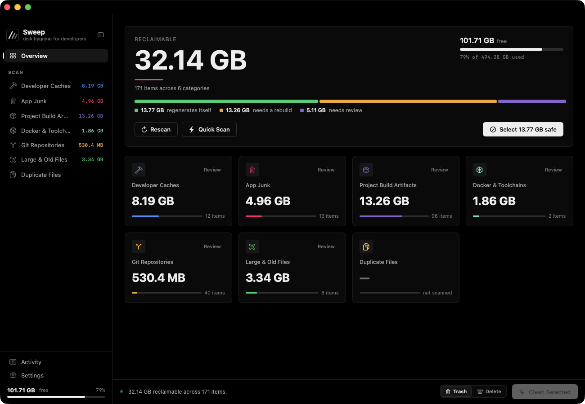
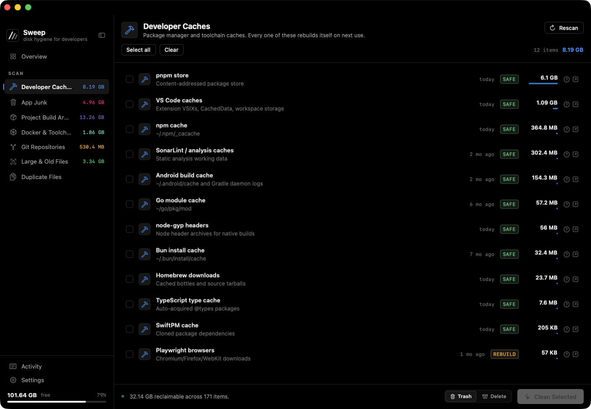
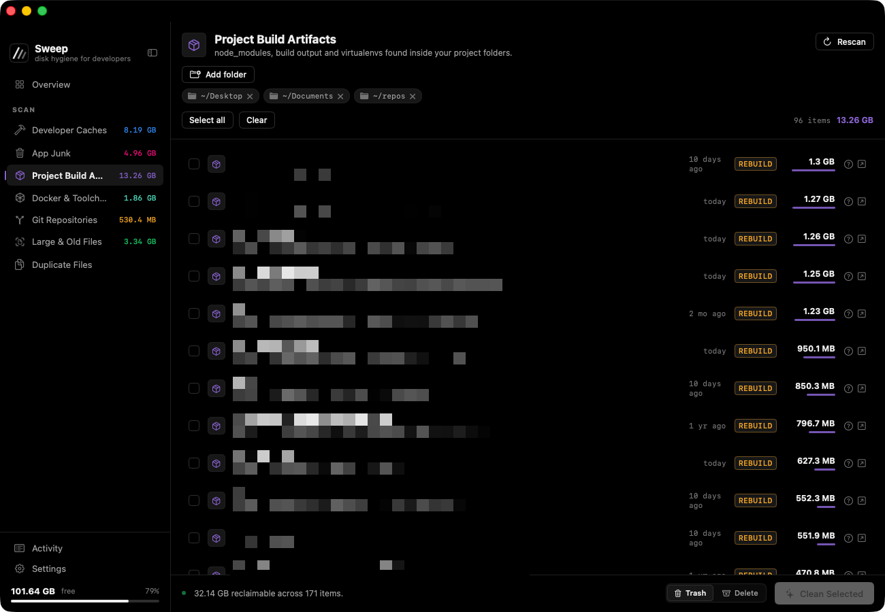
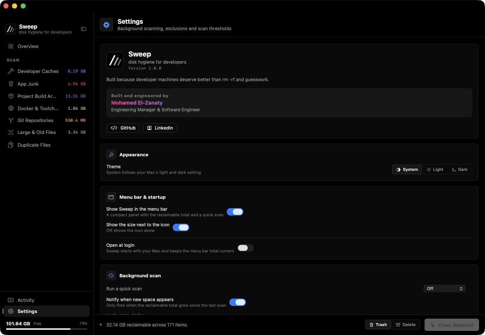

# Sweep

**Disk hygiene for developers.** A macOS app that finds the gigabytes your toolchain is sitting on — and tells you what each one costs to delete before you delete it.

Every package manager, build tool and container runtime keeps a cache. None of them clean up after themselves. Sweep finds them, groups them by what removal actually costs you, and gets out of the way.

Requires macOS 14+.



## Install

### Homebrew

```
brew tap moelzanaty3/tap
brew trust moelzanaty3/tap
brew install --cask --no-quarantine sweep
```

Two of those lines need explaining:

- **`brew trust`** — Homebrew refuses to load casks from third-party taps until you say you trust the tap. This is Homebrew's check, and it applies to every tap outside `homebrew/cask`.
- **`--no-quarantine`** — Sweep is not notarized by Apple yet, so without it macOS refuses to open the app. It becomes a plain `brew install --cask sweep` once notarized.

### From source

No toolchain surprises, and you get to read what you are about to run:

```
git clone https://github.com/moelzanaty3/sweep.git
cd sweep
bash build.sh install
```

That builds a release binary, generates the icon, assembles `Sweep.app` and copies it to `/Applications`. Drop `install` to leave it in `dist/`. A locally built app carries no quarantine attribute, so Gatekeeper stays out of the way entirely.

### Direct download

Grab the `.dmg` from [Releases](https://github.com/moelzanaty3/sweep/releases) — checksums are attached to every one. Right-click the app and choose **Open** the first time, for the same notarization reason.

## What it scans

| Category | What it finds |
|---|---|
| **Developer Caches** | 38 known package-manager and toolchain cache locations — npm, pnpm, yarn, pip, Cargo, Go, Gradle, Maven, CocoaPods, SwiftPM, Xcode DerivedData, and more |
| **App Junk** | Application caches, logs, crash reports, stale installers, old backups |
| **Project Build Artifacts** | `node_modules`, `target/`, `build/`, `.next`, virtualenvs — found by walking your project roots |
| **Docker & Toolchains** | Reclaimable space reported by Docker, Homebrew, SDK managers, the iOS simulator runtime |
| **Git Repositories** | Loose objects and unreachable history that `git gc` can pack away |
| **Large & Old Files** | Files above a size threshold, or untouched past a cutoff |
| **Duplicate Files** | Byte-identical copies, grouped into sets with the newest kept |

## Risk tiers

The idea the whole app is built on. Nothing is presented as a flat list of bytes — every item is classified by what deleting it actually costs:

| Tier | Meaning |
|---|---|
| **SAFE** | Regenerates automatically. Nothing is lost. |
| **REBUILD** | Comes back, but costs you a build or a re-download. |
| **PROTECTED** | Needs a human look. Never selected for you. |

The header states the split — how much is reclaimable, how much of that is risk-free — and one action acts on it. **Select all safe** never touches anything above the safe tier.

Every item carries a hand-written rationale. Click the **?** on any row to see what recreates it and at what cost. No magic numbers to trust.

## Safety

Sweep deletes files, so the guard rails matter more than the features.

`Cleaner.isRemovable()` is the last line of defence and runs on every path before removal. It refuses:

- anything outside your home directory
- any path containing `..`
- anything shallower than two path components, unless the catalog named it explicitly
- `~/Library/Keychains`, `~/Library/Preferences`, `~/.ssh`, `~/.gnupg`, `~/Library/Application Support/com.apple*`, `~/Library/Mobile Documents` (iCloud)

Beyond that:

- **Move to Trash is the default.** Permanent deletion is opt-in, per session, in Settings.
- **Nothing is selected without you.** Scanning never deletes. Selection is explicit, and one control clears it.
- **Whitelist** any project path so it never appears in results.
- **Photos and Music libraries are never touched.** They are excluded from the default roots and from traversal — both because those libraries must never be cleaned piecemeal, and because merely measuring them trips a macOS privacy prompt.

Read [`Sources/MacCleaner/Core/Cleaner.swift`](Sources/MacCleaner/Core/Cleaner.swift) before you trust it. That is the point of shipping the source.

## Features

- **Menu bar item** with the current reclaimable total, toggleable
- **Scheduled background scans** — hourly, 6-hourly, daily, weekly, or off
- **Open at login** via `SMAppService`
- **Light / Dark / System** appearance
- **Accessibility text sizing** — honours System Settings › Accessibility › Display › Text size
- **Collapsible sidebar** (`⌘\`)

## Screenshots

**Developer Caches** — every entry names what it is, when it was last touched, and what tier it sits in. The **?** on each row explains what recreates it.



**Project Build Artifacts** — walks the roots you choose for `node_modules`, build output and virtualenvs. Project names are pixellated here; the app shows them in full.



**Settings** — appearance, menu bar, launch at login, background scan cadence, whitelist and thresholds.



## CLI

The same binary runs headless — useful for checking a machine over SSH, or for verifying what the GUI reports:

```
/Applications/Sweep.app/Contents/MacOS/Sweep --scan
/Applications/Sweep.app/Contents/MacOS/Sweep --scan --all
```

`--scan` covers caches, app junk and toolchains. `--all` adds the slower filesystem walks: projects, git repos, large files and duplicates. The CLI only ever reports — it never deletes.

## Build

```
swift build                # debug
bash build.sh              # release .app into dist/
bash build.sh install      # release .app into /Applications
```

Swift 6 toolchain, SwiftPM, no dependencies.

## Author

**Mohamed El-Zanaty** — Engineering Manager & Software Engineer

[GitHub](https://github.com/moelzanaty3) · [LinkedIn](https://www.linkedin.com/in/moelzanaty3/)

Built because developer machines deserve better than `rm -rf` and guesswork.

## Contributing

See [CONTRIBUTING.md](CONTRIBUTING.md). Most contributions are new cache locations, and the guide covers what a good entry needs — a risk tier chosen conservatively, and a rationale written for someone who does not know the tool.

## License

MIT. See [LICENSE](LICENSE).
